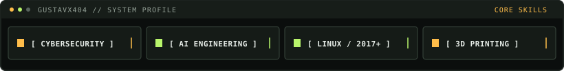
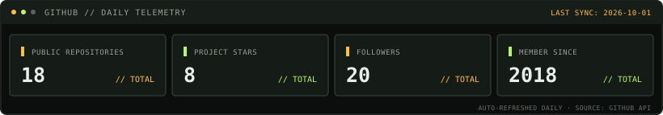

# Gustav · `@Gustavx404`

[English](README.md) · [Português (Brasil)](README.pt-BR.md)

**Cybersecurity → AI engineering**

I build practical tools, explore secure systems, and have used Linux since 2017.

`$ connect --linkedin --tryhackme`

[LinkedIn](https://www.linkedin.com/in/gustavx404/) · [TryHackMe](https://tryhackme.com/p/Gustavx404)
