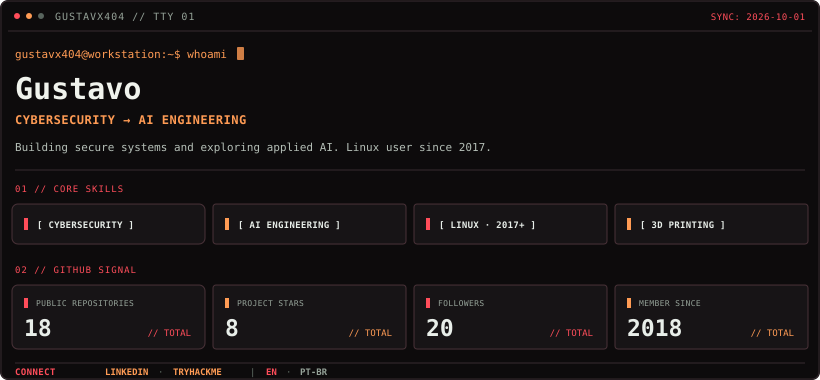

<code>$ connect</code> <a href="https://www.linkedin.com/in/gustavx404/"><code>LinkedIn ↗</code></a> · <a href="https://tryhackme.com/p/Gustavx404"><code>TryHackMe ↗</code></a> <code>| locale</code> <strong><code>EN</code></strong> · <a href="README.pt-BR.md"><code>PT-BR</code></a>

