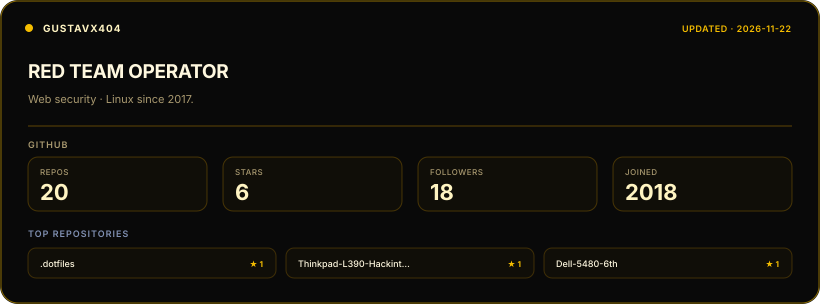

  

  Web security · Linux since 2017 · Open to cybersecurity roles
   
  <a href="https://www.linkedin.com/in/gustavx404/">LinkedIn</a> ·
  <a href="https://tryhackme.com/p/Gustavx404">TryHackMe</a> ·
  <a href="https://github.com/gustavx404?tab=repositories">All repositories</a>

## `~/projects`

- **[ctf-vault](https://github.com/gustavx404/ctf-vault)** — Knowledge base for CTF practice and security research.
- **[homelab](https://github.com/gustavx404/homelab)** — Self-hosted infrastructure with Docker Compose, Suricata, and CrowdSec.
- **[backup-omarchy](https://github.com/gustavx404/backup-omarchy)** — Backup and sync for Omarchy with Quickshell, rclone, and systemd.
- **[atlas-launcher](https://github.com/gustavx404/atlas-launcher)** — Lightweight Java launcher for Android TV 11+ on ARMv7.

GitHub metrics and commit history

  
  

