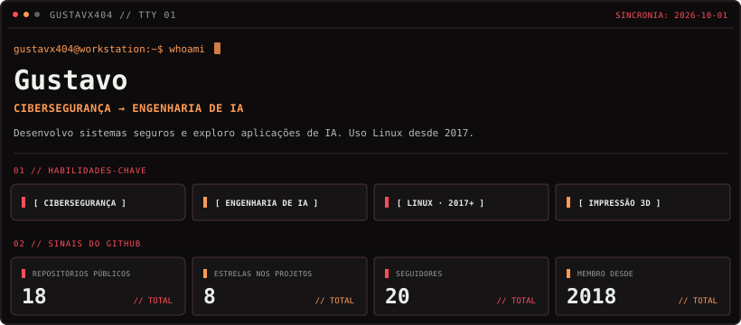

<code>$ idioma</code> · <a href="README.md">EN</a> · <a href="README.pt-BR.md">PT-BR</a>

<code>$ conectar</code> · <a href="https://www.linkedin.com/in/gustavx404/">LinkedIn</a> · <a href="https://tryhackme.com/p/Gustavx404">TryHackMe</a>

