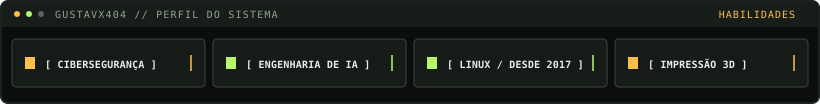
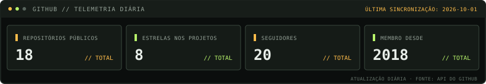

# Gustav · `@Gustavx404`

[English](README.md) · [Português (Brasil)](README.pt-BR.md)

**Cibersegurança → engenharia de IA**

Trabalho com cibersegurança, estou me especializando em engenharia de IA e uso Linux desde 2017.

`$ conectar --linkedin --tryhackme`

[LinkedIn](https://www.linkedin.com/in/gustavx404/) · [TryHackMe](https://tryhackme.com/p/Gustavx404)
